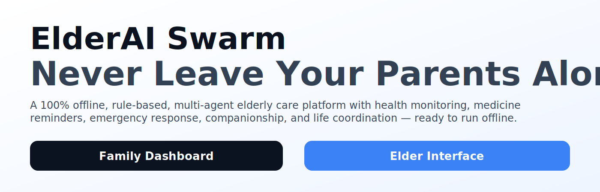

# ElderAI Swarm

Offline-first elderly care platform with 5 agents.

By default, everything runs fully offline (rule-based AI + localStorage). Optionally, you can enable “full AI chat” for the Daily Companion using a local LLM (Ollama) or an OpenAI-compatible API.

## Setup

```bash
npm install
npm run dev
```

Open: http://localhost:5173/

## Routes

- `/` — Landing page
- `/family` — Family Dashboard
- `/elder` — Elder Interface

## Offline-first

- No external APIs
- All AI responses are pre-written + rule-based
- Data persists in `localStorage`

## Optional: Full AI chat (Daily Companion)

Create a `.env` file (see [.env.example](.env.example)) and restart `npm run dev`.

**Ollama (recommended for local AI)**

- Install and run Ollama
- Pull a model (example): `ollama pull llama3.1`
- Set:
	- `VITE_AI_MODE=ollama`
	- `VITE_AI_BASE_URL=http://localhost:11434`
	- `VITE_AI_MODEL=llama3.1`

**OpenAI-compatible**

- Set:
	- `VITE_AI_MODE=openai`
	- `VITE_AI_BASE_URL=...` (must expose `/v1/chat/completions`)
	- `VITE_AI_API_KEY=...`
	- `VITE_AI_MODEL=...`

